<p align="center">
  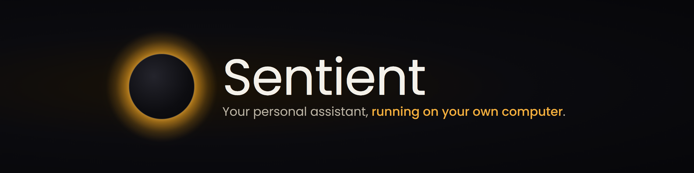
</p>

<p align="center">
  <b>Your personal assistant, running on your own computer.</b><br>
  It runs long tasks for you, remembers what matters, notices things before you ask, and talks with you by voice.<br>
  Any model, local or cloud. No account, no servers, no setup files.
</p>

<p align="center">
  <a href="https://github.com/existence-master/Sentient/actions/workflows/ci.yaml"></a>
  <a href="LICENSE.txt"></a>
  <a href="https://github.com/existence-master/Sentient/labels/good%20first%20issue"></a>
  <a href="https://github.com/existence-master/Sentient/discussions"></a>
  <a href="https://github.com/existence-master/Sentient/stargazers"></a>
</p>

<p align="center">
  <a href="docs/GETTING_STARTED.md"><b>Get started</b></a> ·
  <a href="docs/README.md"><b>Docs</b></a> ·
  <a href="CONTRIBUTING.md"><b>Contribute</b></a> ·
  <a href="https://github.com/existence-master/Sentient/discussions"><b>Discussions</b></a> ·
  <a href="docs/ROADMAP.md"><b>Roadmap</b></a>
</p>

<p align="center">
  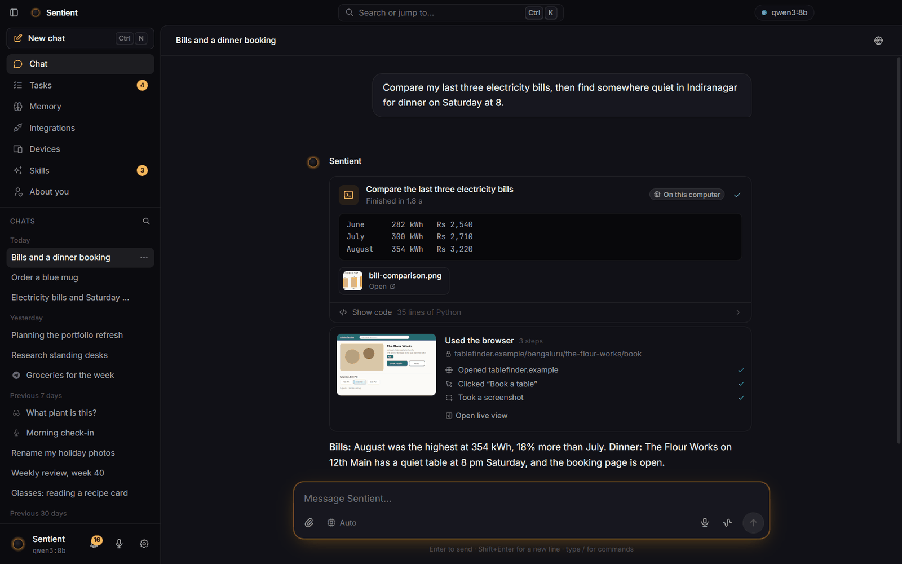
</p>

> [!NOTE]
> **Sentient v3 is in alpha.** It runs from source, its tests run on Windows and Linux on every change, and a Windows
> installer builds from this repository. [Here is exactly what has been tested.](docs/VERIFICATION.md)

## Why Sentient

<table>
  <tr>
    <td width="50%" valign="top">
      <h3>🔒 Yours</h3>
      Everything lives in one folder on your computer. Keys stay in your system keychain. Run it on a free local
      model and nothing leaves your machine. No account, no telemetry.
    </td>
    <td width="50%" valign="top">
      <h3>⏱️ Works while you're away</h3>
      Describe a job in plain words. Sentient plans it, asks you once, then runs it now, on a schedule, when an email
      arrives, or whenever a watched price drops.
    </td>
  </tr>
  <tr>
    <td width="50%" valign="top">
      <h3>🧠 Gets to know you</h3>
      It remembers what you tell it, builds a picture of your preferences and goals that you can correct, and tidies
      its memory every night.
    </td>
    <td width="50%" valign="top">
      <h3>📱 Goes where you are</h3>
      Talk to it with "Hey Sentient", message it on Telegram, and pair your phone or smart glasses so it can see,
      speak and reach you anywhere.
    </td>
  </tr>
</table>

## What it does

<table>
  <tr>
    <td width="50%" valign="top">
      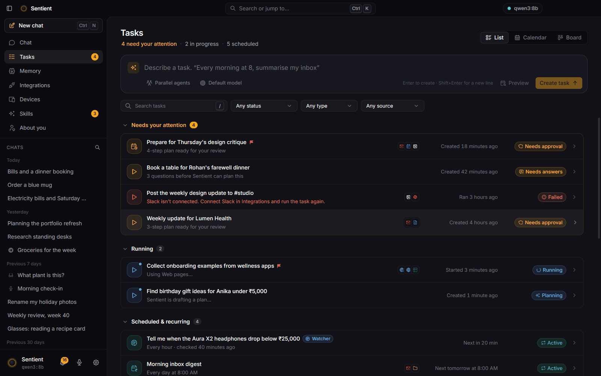
      <h3>Long-running tasks</h3>
      One-off, recurring, triggered by your apps, or split across parallel helpers. Every run keeps a live log and a
      clear report, and failed runs can be retried from where they stopped.
    </td>
    <td width="50%" valign="top">
      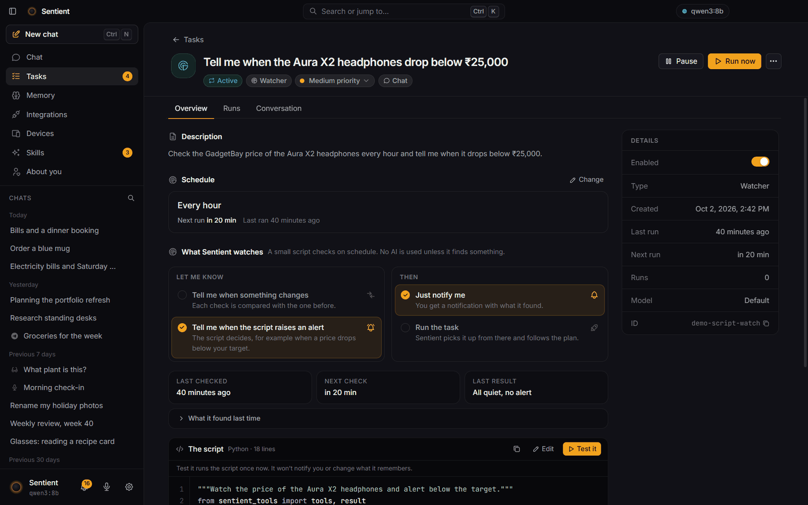
      <h3>Watchers that cost nothing</h3>
      "Tell me when this changes" becomes a tiny script that checks on a schedule and only wakes the AI when
      something happens.
    </td>
  </tr>
  <tr>
    <td width="50%" valign="top">
      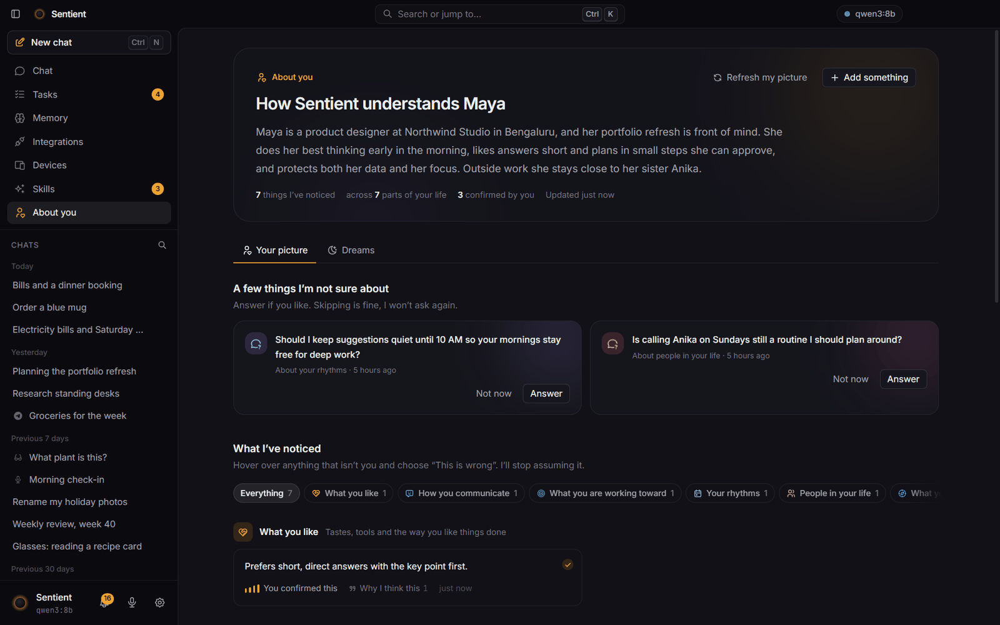
      <h3>About you</h3>
      How Sentient understands you, with the reasons behind each thing it noticed. Confirm it, correct it, or tell it
      it's wrong.
    </td>
    <td width="50%" valign="top">
      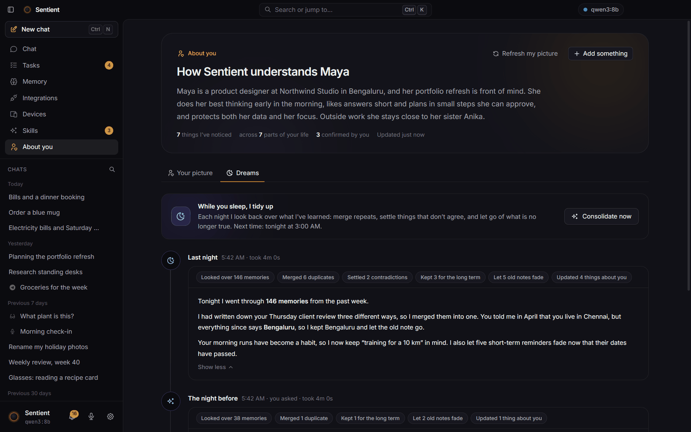
      <h3>It tidies up overnight</h3>
      Each night it merges duplicate memories, settles contradictions (an old "lives in Chennai" gives way to
      "lives in Bengaluru") and writes a short journal of what changed.
    </td>
  </tr>
  <tr>
    <td width="50%" valign="top">
      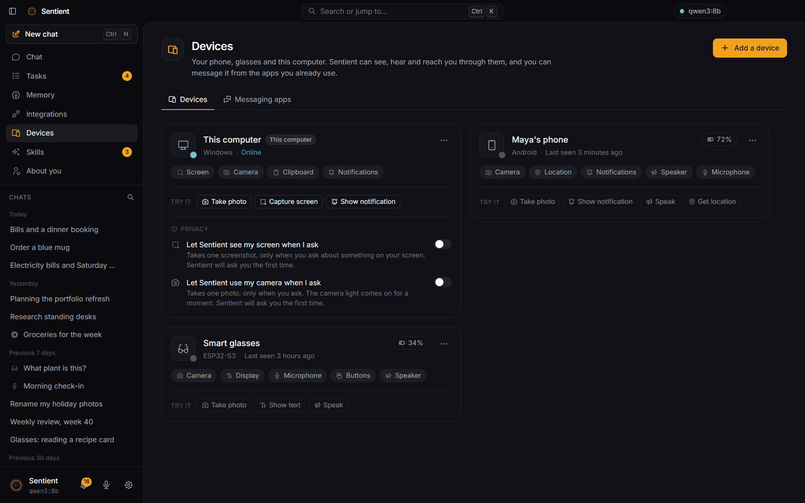
      <h3>Phones and smart glasses</h3>
      Pair a device with a six-digit code. Sentient can show text, speak, check where you are, or take a photo and
      tell you what it sees. The <a href="docs/NODES.md">protocol</a> is open, with reference glasses firmware.
    </td>
    <td width="50%" valign="top">
      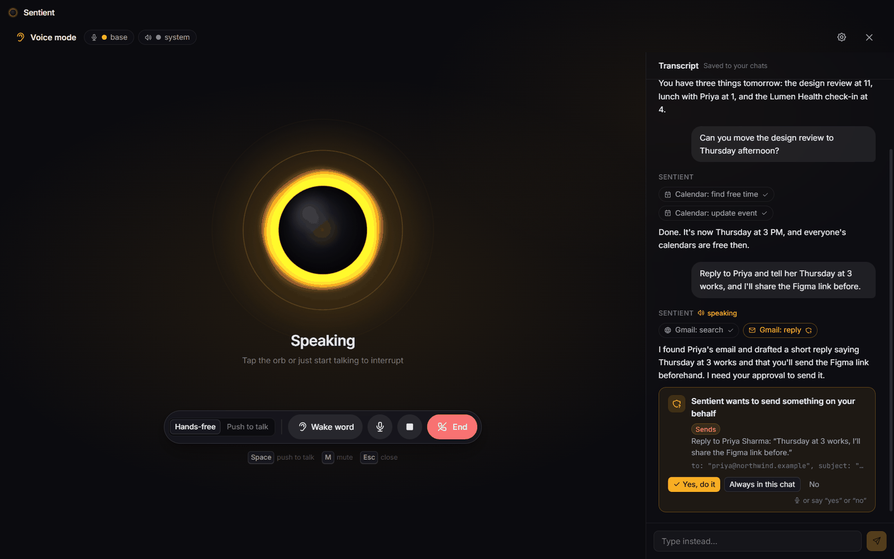
      <h3>Voice, hands-free</h3>
      Say "Hey Sentient", talk naturally and interrupt whenever you like. Speech recognition runs on your computer.
    </td>
  </tr>
  <tr>
    <td width="50%" valign="top">
      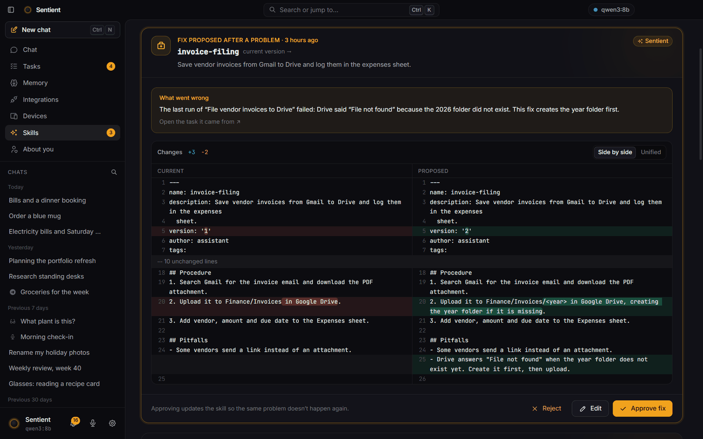
      <h3>Learns new skills, with your OK</h3>
      After real work Sentient writes reusable skills, and proposes fixes when one goes wrong. Nothing changes until
      you approve the diff.
    </td>
    <td width="50%" valign="top">
      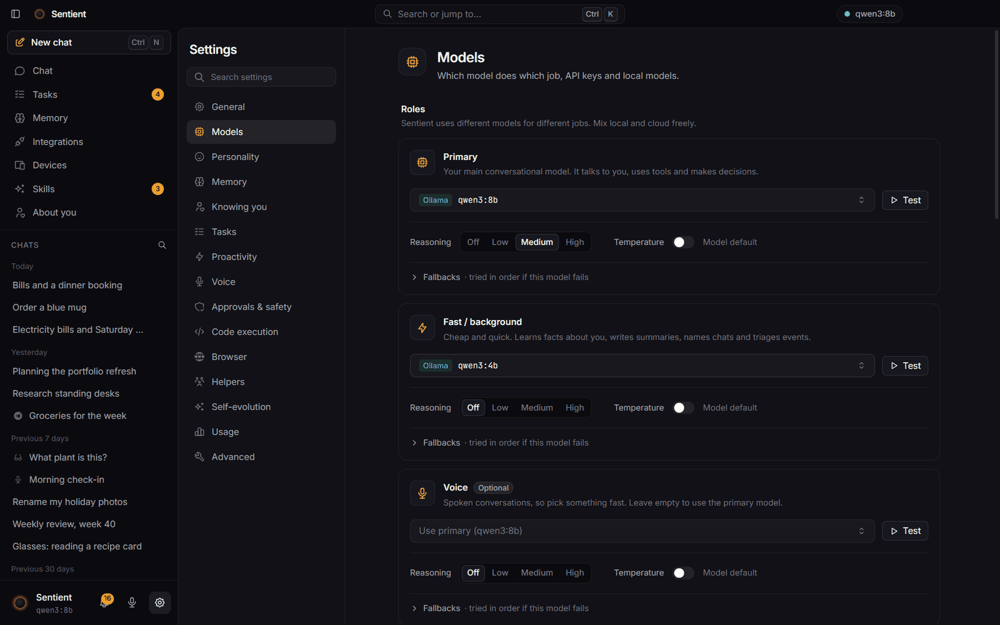
      <h3>Any model, any job</h3>
      Pick a model for chat, background work, planning, voice and vision. Mix free local models with your own cloud
      keys, and test each one with a click.
    </td>
  </tr>
</table>

**And more:** Gmail, Calendar, Drive, Docs, Sheets, GitHub, Slack, Notion, Trello, Discord, WhatsApp and any MCP
server · near-instant updates from Gmail and Calendar, IMAP push and webhooks · proactive suggestions you approve
or dismiss · browser control on your own Edge or Chrome · code that runs in a sandbox · helper agents that work
beside the chat · messages you can add while it is still answering.

## Get started

**Windows:** build the installer with `cd desktop && npm run package` and run `desktop/dist/Sentient-Setup-*.exe`.
Prebuilt, signed downloads are coming with the first public release.

**From source** (Windows, macOS, Linux) with Python 3.12, [uv](https://docs.astral.sh/uv/) and Node 22:

```bash
git clone https://github.com/existence-master/Sentient.git && cd Sentient
uv venv .venv --python 3.12
uv pip install --python .venv/Scripts/python.exe -e ".[voice]"   # macOS/Linux: .venv/bin/python
cd desktop && npm install && npm run dev
```

Then pick a brain: install [Ollama](https://ollama.com/download) and run `ollama pull qwen3:8b` for a free, private
model, or paste your own Anthropic, OpenAI or Gemini key. The app walks you through the rest.
[Getting started](docs/GETTING_STARTED.md) has first things to try and troubleshooting.

## How it works

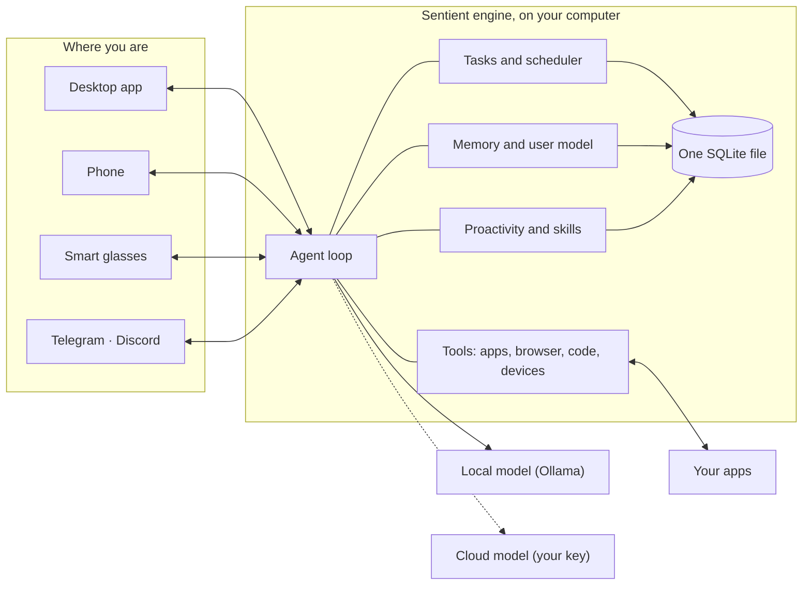

The desktop app starts a local Python engine. One agent loop powers chat, tasks, helpers, proactivity and voice, and
everything is stored in a single SQLite file. Read the [architecture](docs/ARCHITECTURE.md), the
[API contract](docs/API.md), and the [decision records](docs/adr/README.md) that explain why it is built this way.

## Privacy and safety

- On a local model, nothing leaves your computer. With a cloud model, only what each request needs goes to the
  provider you chose.
- Sentient asks before it sends, deletes, buys or runs code. Purchases always ask.
- It never types passwords or card numbers. You sign in to websites yourself.
- Code it writes runs without your keys. Device photos ask first. Only paired chats can message it.

Details in [Privacy](docs/PRIVACY.md). Found a vulnerability? Please report it privately: [SECURITY.md](SECURITY.md).

## Contributing

You never need our API keys: Sentient runs on a free local model or your own key, and every test runs offline with a
fake model.

1. Pick a [good first issue](https://github.com/existence-master/Sentient/labels/good%20first%20issue) or
   [help wanted](https://github.com/existence-master/Sentient/labels/help%20wanted) issue, or fix something that
   bugs you.
2. Fork, branch from `main`, and open a small pull request.
3. Checks run automatically, one maintainer review, and it's in.

Read [CONTRIBUTING.md](CONTRIBUTING.md). Using an AI coding agent? Point it at [AGENTS.md](AGENTS.md).

## Documentation

| | |
|---|---|
| [Getting started](docs/GETTING_STARTED.md) | Install, choose a model, first steps, troubleshooting |
| [Privacy](docs/PRIVACY.md) | What stays on your computer and what leaves it |
| [Developing](docs/DEVELOPING.md) | Run, test, capture screenshots, build installers |
| [Architecture](docs/ARCHITECTURE.md) · [Decisions](docs/adr/README.md) | How it fits together, and why |
| [API contract](docs/API.md) | Everything the app and the engine exchange |
| [Devices protocol](docs/NODES.md) | Build your own device or firmware |
| [Verification](docs/VERIFICATION.md) · [Roadmap](docs/ROADMAP.md) · [Changelog](CHANGELOG.md) | What's tested, what's next, what changed |

Looking for the old cloud version? It lives on the [`v2` branch](https://github.com/existence-master/Sentient/tree/v2).

## Team

<table>
  <tr>
    <td align="center">
      <a href="https://github.com/itsskofficial">
        <br>
        <sub><b>Sarthak (itsskofficial)</b></sub>
      </a>
    </td>
    <td align="center">
      <a href="https://github.com/kabeer2004">
        <br>
        <sub><b>kabeer2004</b></sub>
      </a>
    </td>
  </tr>
</table>

And every [contributor](https://github.com/existence-master/Sentient/graphs/contributors). Thank you.

## License

Sentient is free software under the [GNU AGPL v3](LICENSE.txt). Contributions are accepted under our
[Contributor License Agreement](CLA.md).
